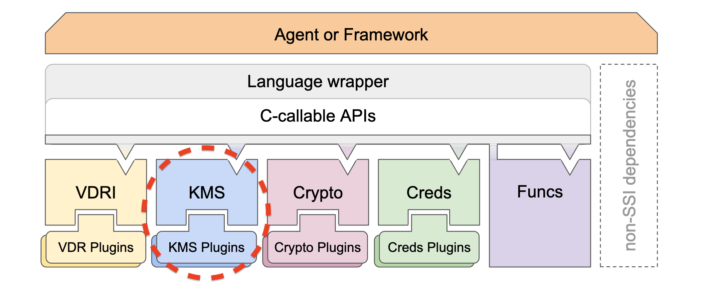
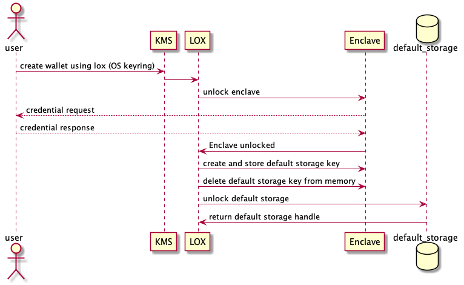
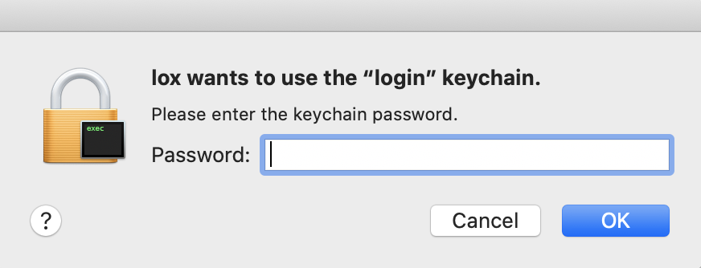

# Aries RFC 0276: Key Management Service 
- Authors: Cam Parra, Mike Lodder
- Status: [PROPOSED](/README.md#proposed)
- Since: 2019-10-30
- Status Note: Still needs some review from community members  
- Supersedes: [Aries RFC 0050](https://github.com/hyperledger/aries-rfcs/tree/master/concepts/0050-wallets)
- Start Date: 2018-10-30
- Tags: feature, protocol

## Summary



This RFC will cover the following: 

- What is a Key Management Service? (Here after I will refer to this as KMS)

## Motivation


Agents that do not design key management as a first class citizen are bound to get their security wrong. Here’s why. There are five areas to consider when agents manage keys: what is their purpose, creation, recovery, revocation, and replication. Private keys used for digital signatures or encryption should not be shared among agents or if sharing is required, shared as little as possible. Keys should be as short lived as possible and have a single purpose. This limits the need to replicate keys to other agents, either for dual functionality or recovery purposes, as well as damage in the event of a compromise.


## Tutorial


***

The following tutorial assumes that when you start aries-kms you choose to use LOX that's been configured with your keyring. We will use Alice to go through the process of unlocking her sqlite instance in which she stores her self sovereign credentials. Keep in mind this is for individual use. This should eventually grow to enterprise level and should be broadened by a future RFC.

Alice loads up Aries-KMS cli (for POC purposes). She is prompted to pick a service to handle her keys. She goes to the default that is set to locks and using KeyChain on her MacBook Pro. Lox is then invoked which securely communicates with the Enclave or keyring on the device. The keyring then prompts the user for their **KeyRing** credentials.



The enclave then is securely unlocked and the key creation process begins for the default storage. Then lox uses the enclave to unlock the default stoage and retrieve the handle for the item that was queried.


## Reference
Authentication - Who is allowed to access the KMS? How is access authenticated?
Cryptography - What algorithms and operations are supported?
Storage - Where is the data and metadata stored?
Logic - How are keys handled and what are they used for? Are they searchable? Are they encrypted?
***

### The Five Elements of KMS 

#### Authentication

A consumer of KMS must decide who has access to the KMS. This can be done through various ways: username and password, biometrics, certificates, keys,system etc. This layer has one function: open. For example with a postgres database the authentication layer would open keyring after correct credentials are recieved and then it would use those credentials to retrieve it's store keys to unlock the postgres database.


```c
//
// Created by Camilo Parra on 2019-11-06.
//

#ifndef lox_h
#define lox_h

/* opens the desired storage by using keyring, enclave, etc
*
*  @param [in] `config` - a json string that details what or where key is stored, type of storage, name of storage
*  @param [out] `error` - an error structure that can be checked if an error occurs. Includes a code and string message. If success, no further checking is needed
*  @return 1 - success, 0 otherwise
*/

extern int32_t lox_open(const char * const config);

#endif //lox_h
```

#### Authorization 


#### Cryptography

The cryptography layer is where all the basic functions of key creation live. These include create, delete, sign, verify, encrypt, decrypt, aggregate.

#### Storage

In the storage layer we are able to plugin a database, enclaves, HSMs, Key Rings, and others. This layer contains the keys and their metadata.

#### Logic

This layer ties everything together in the KSM. Here the consumer of KSM decides how they will handle keys and what they will use them for. This is layer will also close and delete all data from memory if that is the way that the consumer chooses to handle their keys.


1. **OS Keystore** : native operating system password vault *i.e. MacOS Keyring, Windows Credential Manager* 
2. [**LOX**](https://github.com/hyperledger/aries-rfcs/tree/master/features/0042-lox): A command line tool for accessing various keychains or secure enclaves
3.  Pornin, T., Why Constant Time Crypto, accessed at https://www.bearssl.org/constanttime.html on 2019-10-01

## Drawbacks

KMS presents a new way of doing key management. This is not wrapped up in a nice package that has already made assumptions for you. Therefore bringing in overhead to implement and will take a bit for the community to get used to the concept and workings of KMS. 

## Rationale and alternatives

Here are threats that all KMS services and why we think this is a good implementation that will mitigate these threats. 
*** 
### ***Threats***
- Memory access patterns leakage - Attacker can infer contents and/or importance of data based on how it is accessed and frequency of access. Attacker learns the set of matching records.
- Volume leakage - Attacker learns the number of records/responses.
- Search pattern leakage - Attacker can infer the contents and/or importance of data based on search patterns–attacker can easily judge whether any two queries are generated from the same keywords or not.
- Rank leakage - Attacker can infer or learn which data was queried
Side channel leakage - Attacker can access or learn the value of the secret material used to protect data confidentiality and integrity through side channels like memory inspection, RAM scraping, attacks with swap access, and timing attacks[3].
- Microarchitectural attacks - Attacker is able to learn secrets through covert channels that target processors (Spectre/Meltdown)
### ***Adversary***
- Network adversary - observes traffic on network. In addition to snooping and lurking, they can also perform fingerprinting attacks to learn who are the endpoints and correlate them to identical entities.
- Snapshot adversary - breaks into server, snapshots system memory or storage. Sees copy of encrypted data but does not see transcripts related to any queries. Trade off between functionality and security.
- Persistent adversary - corrupts server for a period of time, sees all communication transcripts.
- Honest but curious adversary - System Administrator that can watch accesses to the data

****

These are our derived goals from the threats and adversaries mentioned above.

### Goals
- Privacy - Adversary learns as little as possible about data and queries
- Security - Adversary cannot read/decrypt data or queries
- Anonymity - Adversary does not learn who are the data processors
- Performance - Raise the bar for attackers w/o hurting performance too much


## Prior art

| Aries-KMS |   Indy-Wallet  |
| ------------- |-------------|
| Securely creates, deletes, manages keys and their metadata|  securely creates, manages keys| 
| Does NOT manage general storage|  manages general storage| 
| Integrates with OS keystore / ACL / biometrics (LOX)| No LOX support |
|Leverages HMS / TEE / secure enclave when present| Is secure enclave like|
|Plugins for different persistence mechanisms|plugable persistance mechanism for general storage and keys|
|Plugins for different crypto approaches|No plugable crypto|

This example will take an in-depth look at how Hyperledger Indy’s wallet applies the principles of KMS design.

Authentication
The Indy wallet allows the consumer to supply a raw AES-256 symmetric key to open the wallet. The key can be derived from a password using Argon2, or generated at random. This key must be securely stored outside the wallet. 

Authorization
The key gives full access to all data. Authorization is controlled keeping the authentication key in memory and using it to decrypt all other keys.

Cryptography
Indy uses the IETF variant for ChaCha20Poly1305 with 96 bit nonces to encrypt data and HMAC256 when creating deterministic nonces, and the operating system random number generator for random nonces. The cryptography layer is not pluggable.

Storage
The storage layer is pluggable with the default using SQLite. All data is encrypted prior to being stored and decrypted after retrieval.

Logic
Indy functions similar to a Secure Enclave in that it does not give direct access to signing keys. Indy does not offer direct methods for consumers to encrypt/decrypt miscellaneous data. Indy provides its own wallet query language that creates encrypted queries prior to passing the search to the storage layer. The storage layer executes the query over encrypted data then returns the encrypted results


## Unresolved questions 

- How can we scale this design to enterprise use?
   
## Implementations

*Implementation Notes* [may need to include a link to test results](README.md#accepted).

Name / Link | Implementation Notes
--- | ---
 | 

